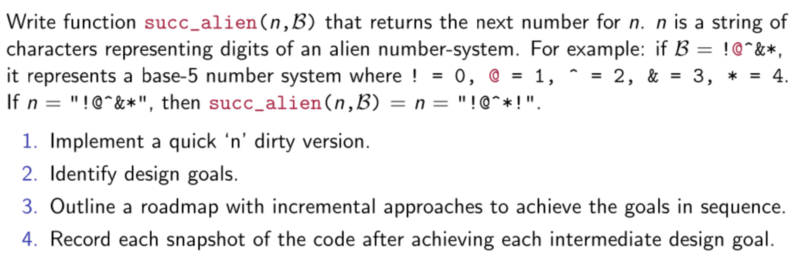

This code is the solution to solve the following question

## Steps for running different versions of code

* Fork and clone the code into your system.
* Once you got this repository into your system, the following command with the version number of the code you want to run will generate an executable file for that version. For the alien.cpp file, the version number is 1 and for the others 2 and 3.

```bash
make v<version number>
```
* For example, if you want to compile the file, alienv2.cpp then, you have to run the command
```bash
make v2
```